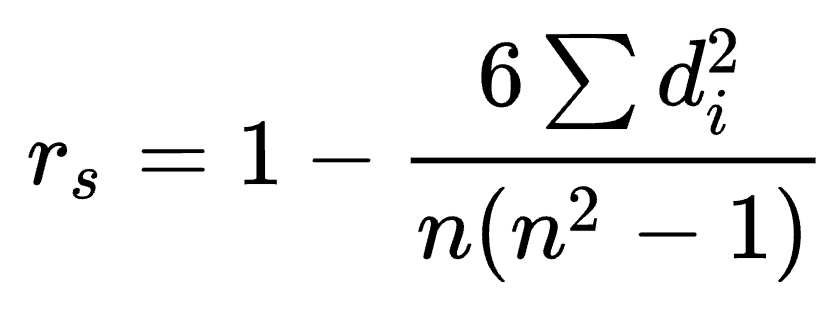

# Summary

In this homework, I compared search results for 100 queries, using Google, and a non-Google engine (for me, it's DuckDuckGo).

# Spearman's rank correlation coefficient

where,

● *di* is the difference between the two rankings

● *n* is the number of observations (refers to the number of URL matches)

## Meaning

If the rank results of one search engine are near the rank of the other, then the Spearman correlation value is positive. 

If the rank of one is dissimilar to the rank of the other, then the Spearman correlation value will be negative.\

## Note

If *n=1* (which means only one paired match), we deal with it in a different way:

1. if Rank in your result = Rank in Google result → *rho=1*
2. if Rank in your result ≠ Rank in Google result → *rho=0*

# Tasks

## Task1: Scraping results from your assigned search engine

Develop a script (computer program) that could scrape the top 10 results from my assigned search engine.

**Always incorporate a random delay between 10 to 100 seconds while scraping multiple queries, else I may be blocked off by the search engine and they may not allow you to scrape results for several hours.** 

Generate a JSON file that will store your results in the JSON format described above and repeated here.

For reference:

● https://pypi.org/project/beautifulsoup4, a python library for parsing HTML documents

● URLs for the search engines:

​	○ Bing: http://www.bing.com/search?q=

​	○ Yahoo!: http://www.search.yahoo.com/search?p=

​	○ Ask: http://www.ask.com/web?q=

​	○ DuckDuckGo: https://www.duckduckgo.com/html/?q=

For each URL, you can add your query string after q=

● Selectors for various search engines, you grab links by looking for href in these selectors:

​	○ Bing: [“li”, attrs = {“class” : “b_algo”}]

​	○ Yahoo!: ["a", attrs = {"class" : "ac-algo fz-l ac-21th lh-24"}]

​	○ Ask: ["div", attrs = {"class" : "PartialSearchResults-item-title"}]

​	○ DuckDuckGo: ["a", attrs = {"class" : "result__a"}]

## Task2: Determining the Percent Overlap and the Spearman Coefficient

Use the JSON file that you generated in Task 1 and the Google reference dataset that is provided by us and compare the results as shown in the **Determining Correlation** section above. The output should be a **CSV** file with the following information.

1. Use the JSON file generated in Task 1 and do the following steps on each query.
2. Determine the URLs that match with the given reference Google dataset and their position in the search engine result list.

3. Compute the percent of overlap.

4. Compute the Spearman correlation coefficient.

5. Once you run all of the queries, collect all of the top ten URLs and compute the statistics.

## Points to note

● Always incorporate a delay while scraping. Better use a random delay with a range of 10 to 100 seconds.

● People will likely be blocked off from the search engine if they do not implement some delay in the code.

● People should ignore the People Also Ask boxes and any carousels that may be included in the results.

● People should ignore Ads and scrape only organic results

# Resource

[Here](https://bytes.usc.edu/cs572/s24-s-e-a-r-c-hhh/hw/HW1/HW1.pdf) are the details.

Here are the queries and Google results that are described in the HW1.pdf linked above [you'll only need to use just ONE of the four pairs below - based on the last 2 digits of your student ID [ranges 01-25, 26-50, 51-75, 76-99]:

• [100QueriesSet1](https://bytes.usc.edu/cs572/s24-s-e-a-r-c-hhh/hw/HW1/100QueriesSet1.txt), and [Google_Result1](https://bytes.usc.edu/cs572/s24-s-e-a-r-c-hhh/hw/HW1/Google_Result1.json)

• [100QueriesSet2](https://bytes.usc.edu/cs572/s24-s-e-a-r-c-hhh/hw/HW1/100QueriesSet2.txt), and [Google_Result2](https://bytes.usc.edu/cs572/s24-s-e-a-r-c-hhh/hw/HW1/Google_Result2.json)

• [100QueriesSet3](https://bytes.usc.edu/cs572/s24-s-e-a-r-c-hhh/hw/HW1/100QueriesSet3.txt), and [Google_Result3](https://bytes.usc.edu/cs572/s24-s-e-a-r-c-hhh/hw/HW1/Google_Result3.json)

• [100QueriesSet4](https://bytes.usc.edu/cs572/s24-s-e-a-r-c-hhh/hw/HW1/100QueriesSet4.txt), and [Google_Result4](https://bytes.usc.edu/cs572/s24-s-e-a-r-c-hhh/hw/HW1/Google_Result4.json)

