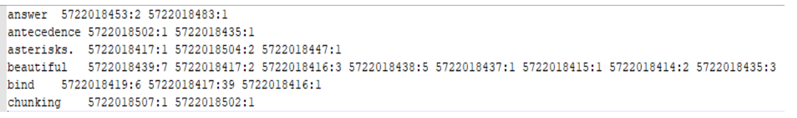
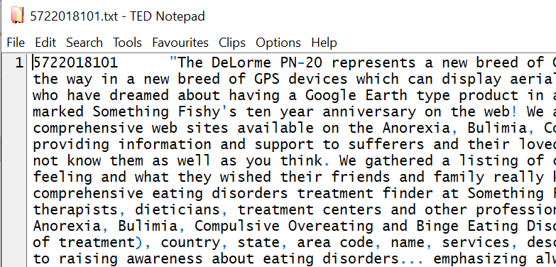

# Summary

Write code that indexes words from multiple text files, and outputs an inverted index that looks like this:



# Description

There are two directories with text files in them: '**devdata**' (with 5 files), '**fulldata**' (with 74 files).

The input data is already cleaned, that is all the **\n\r** characters are removed. **But one or more \t chars might still be present** (which needs to be handled).

There is **punctuation** that also needs to be handled: **replace** all the occurrences of special (punctuation) characters and numerals with the space character, and convert all the words to **lowercase**.

A single ‘\t’ separates the key (**docID**) from the value (actual document contents). In other words, the input files are in a key-value format where docID is the key, and the contents are the value; the key and value are separated by a tab:




For the project, we need to create a **unigram index**, and a **bigram one**. Details are in the two sections that follow.

## Unigram index

Create a file called **unigram_index.txt**, containing words from files in **fulldata**.

Modify the mapper to **output (word, docID)**

Also, [**use a HashMap** data structure](https://www.geeksforgeeks.org/java-util-hashmap-in-java-with-examples/) in the reducer.

## Bigram index

Create a file called **selected_bigram_index.txt**, containing the inverted index for just these five bigrams, using files in **devdata**:

```
computer science
information retrieval
power politics
los angeles
bruce willis
```

Modify the mapper, to **output (word1 word2, docID)** pairs, rather than the (word, docID) pairs in the unigram task.

There is no need to change the reducer.


# Resource

[A self-contained, complete, minimal MapReduce example that counts words in two input documents](https://replit.com/@satychary/HadoopWordCounter)