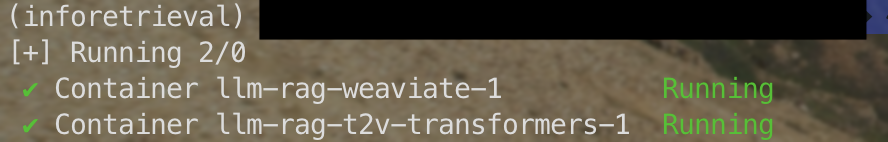
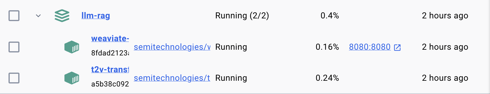
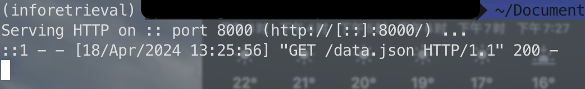
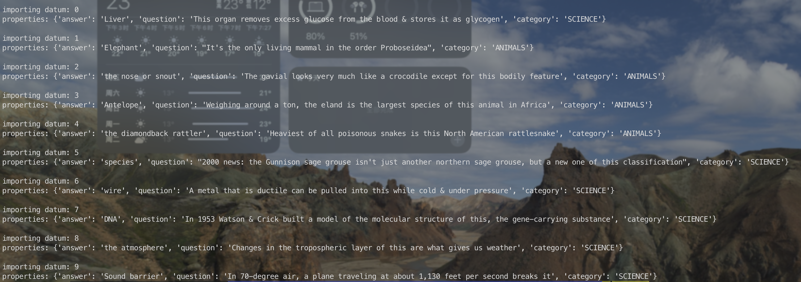
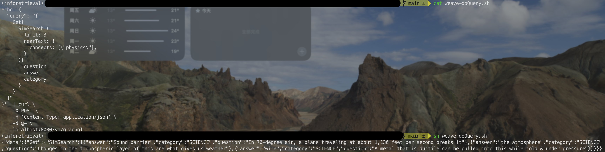
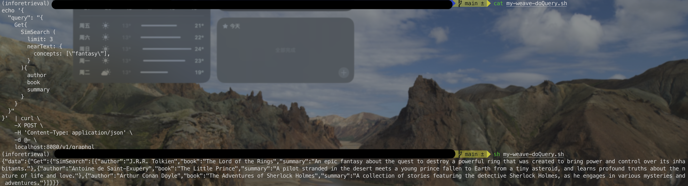

# Summary

- Use [Weaviate](https://weaviate.io/), which is a vector DB - stores data as vectors after vectorizing, and computes a search query by vectorizing it and does a similarity search with existing vectors
- Crawl the web using a Node package, to compile a 'knowledge base' [to use subsequently as input to build a [custom GPT](https://openai.com/blog/introducing-gpts)]
- Using a Python module, perform RAG(Retrieval-augmented generation) on a 'small', locally-hosted LLM (make that an 'S'LM)


# Before start

Please make sure you have these installed, before starting: git, Docker, Node, Python (or Conda/Anaconda), [VS 2022](https://bytes.usc.edu/cs572/s24-s-e-a-r-c-hhh/hw/HW4/pics/vs2022_inst.png) [with 'Desktop development with C++' checked].


# Part 1

Use vector-based similarity search, to retrieve search results that are not keyword-driven.

Three steps:

- Install Weaviate plus vectorizer via Docker as images, run them as containers
- Specify a schema for data, upload data/knowledge (in .json format) to have it vectorized
- Run a query (which also gets vectorized and then sim-searched), get back results (as JSON)


## Step 1. Installing Weaviate and a vectorizer module

After installing Docker, bring it up (eg. on Windows, run Docker Desktop).

Then, in the (ana)conda shell, run this docker-compose command that uses [docker-compose.yml](https://github.com/Pasxsenger/Information-Retrieval-and-Web-Search-Engines/blob/main/LLM-RAG/docker-compose.yml) config file to pull in two images: the 'weaviate' one, and a text2vec transformer called 't2v-transformers'

```shell
docker-compose up -d
```





Now we have the vectorizer transformer (to convert sentences to vectors), and weaviate (our vector DB search engine) running! On to data handling :)


## Step 2. Loading data to search for

This is the data (knowledge, aka external memory, ie. prompt augmentation source) that we'd like searched, part of which will get returned to us as results.

The data is represented as an array of JSON documents, which is [data.json](https://github.com/Pasxsenger/Information-Retrieval-and-Web-Search-Engines/blob/main/LLM-RAG/data.json). 

As you can see, each datum/'row'/JSON contains three k:v pairs, with 'Category', 'Question', and 'Answer' as keys.

The overall idea is: we'd get the 10 documents vectorized, then specify a query word, eg. 'biology', and automagically have that pull up related docs, eg. the 'DNA' one (even if the search result doesn't contain 'biology' in it)! This is a really useful **semantic** search feature where we don't need to specify exact keywords to search for.


Start by installing the weaviate Python client:

```shell
pip3 install weaviate-client
```

Then, **run a local webserver** [in a separate ana/conda (or other) shell], eg. via python ['serveit.py'](https://github.com/Pasxsenger/Information-Retrieval-and-Web-Search-Engines/blob/main/LLM-RAG/serveit.py) - it's what will 'serve' data.json to weaviate :)

```shell
python serveit.py
```




So, how to submit our JSON data, to get it vectorized? Simply use the Python script [weave-loadData.py](https://github.com/Pasxsenger/Information-Retrieval-and-Web-Search-Engines/blob/main/LLM-RAG/weave-loadData.py), do:

```shell
python weave-loadData.py
```

**Note**: For the **<u>first time</u>** running the **weave-loadData.py**, comment the line ```client.schema.delete_class("SimSearch")```, since the "SimSearch" has not been created.



If look in the script, you'll see that we are creating a schema - we create a class called "SimSearch".

The data we load into the DB, will be associated with this class (the last line in the script does this via add_data_object()).


Great! Now we have specified our **searchable data**, which has been first vectorized (by 't2v-transformers'), then stored as vectors (in weaviate).


## Step 3. Querying our vectorized data

To query, use this simple shell script called [weave-doQuery.sh](https://github.com/Pasxsenger/Information-Retrieval-and-Web-Search-Engines/blob/main/LLM-RAG/weave-doQuery.sh), and run this:

As shown in the script, we search for 'physics'-related docs, and sure enough, that's what we get:



Why is this exciting? **<u>Because the word 'physics' isn't in any of our results!</u>**


## My version

* First, **MODIFY the contents of data.json**, to replace the 10 docs in it, with my own data, where I'd replace ("Category","Question","Answer") with ANYTHING you like, eg. ("Author","Book","Summary"), ("MusicGenre","SongTitle","Artist"), ("School","CourseName","CourseDesc")
  * [my-data.json](https://github.com/Pasxsenger/Information-Retrieval-and-Web-Search-Engines/blob/main/LLM-RAG/my-data.json)

* Next, **MODIFY the query keyword(s) in the query .sh file** - eg. query for 'computer science' courses, 'female' singer, 'American' books, ['Indian','Chinese'] food dishes (the query list can contain multiple items), etc. 
  * [my-weave-doQuery.sh](https://github.com/Pasxsenger/Information-Retrieval-and-Web-Search-Engines/blob/main/LLM-RAG/my-weave-doQuery.sh)
* BE SURE to also **modify the data loader .py script**, to put in keys (instead of ("Category","Question","Answer"))
  * [my-weave-loadData.py](https://github.com/Pasxsenger/Information-Retrieval-and-Web-Search-Engines/blob/main/LLM-RAG/my-weave-loadData.py)




# Part 2
